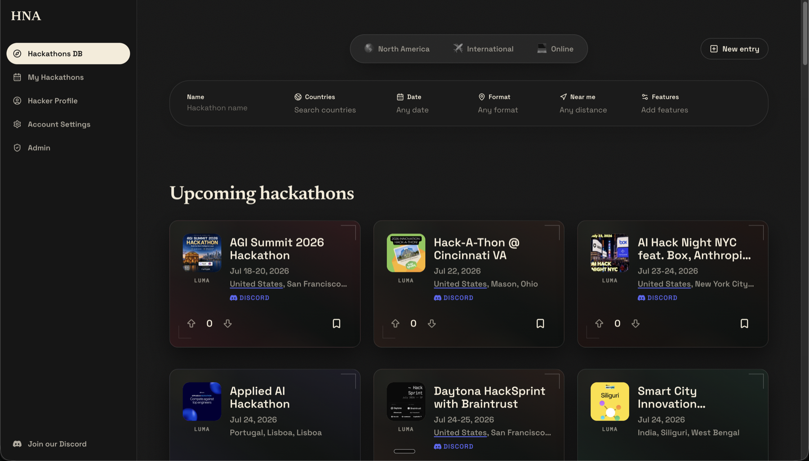

<div align="center">


# Haethon

**The hackathon database for North America — and beyond.**

Discover upcoming hackathons, track the ones you're attending, and get reminded before they start.

[](https://github.com/Hackathons-North-America/haethon/actions/workflows/ci-cd.yml)



</div>

## Features

- **Hackathons DB** — browse upcoming events across North America, international, and online, with filters for name, country, date, format, distance ("near me"), and features.
- **My Hackathons** — save events, upvote them, and track your attendance status.
- **Hacker profiles & accounts** — profile management, email preferences, and one-click unsubscribe.
- **Organizer flow** — submit a hackathon, review attendees, and verify check-ins with per-event codes.
- **Admin console** — moderate submissions, bulk-import events, fix broken links, resolve attendance anomalies, and manage Discord channels.
- **Discord integration** — every hackathon gets a channel, automatically created, sorted by start date, and archived into half-year categories when it ends.
- **Email automation** — event reminders and a weekly digest, sent on a schedule via Resend and Vercel cron.
- **Geo search** — PostGIS-backed city lookup and distance filtering.

## Tech Stack

| Layer | Technology |
| --- | --- |
| Framework | [Next.js](https://nextjs.org) (App Router) + TypeScript |
| Styling | Tailwind CSS + Motion |
| Auth | [Clerk](https://clerk.com) |
| Database | [Neon](https://neon.tech) Postgres (PostGIS, `pg_trgm`) + Drizzle ORM |
| Email | Resend + React Email |
| Uploads | UploadThing |
| Community | Discord REST API |
| Observability | PostHog + Sentry |
| Testing | Vitest + Playwright |
| Hosting | Vercel |

## Getting Started

### Prerequisites

- Node.js 20+
- [pnpm](https://pnpm.io) 11+
- A Neon Postgres database and a Clerk application (free tiers work)

### Install & configure

```bash
pnpm install
cp .env.example .env.local
```

Minimum environment variables to boot the app:

| Variable | Purpose |
| --- | --- |
| `DATABASE_URL` | Neon Postgres connection string |
| `NEXT_PUBLIC_APP_URL` | Base URL, e.g. `http://localhost:3000` |
| `NEXT_PUBLIC_CLERK_PUBLISHABLE_KEY` | Clerk publishable key |
| `CLERK_SECRET_KEY` | Clerk secret key |

<details>
<summary>Full environment reference (analytics, email, Discord, uploads, cron)</summary>

| Variable | Purpose |
| --- | --- |
| `NEXT_PUBLIC_POSTHOG_KEY`, `NEXT_PUBLIC_POSTHOG_HOST` | PostHog analytics |
| `NEXT_PUBLIC_SENTRY_DSN`, `SENTRY_AUTH_TOKEN`, `SENTRY_ORG`, `SENTRY_PROJECT` | Sentry error tracking |
| `RESEND_API_KEY`, `RESEND_AUDIENCE_FROM` | Transactional email |
| `UPLOADTHING_TOKEN` | Admin photo uploads |
| `DISCORD_BOT_TOKEN`, `DISCORD_CLIENT_ID`, `DISCORD_GUILD_ID` | Discord bot credentials |
| `DISCORD_CANADA_CATEGORY_ID`, `DISCORD_US_CATEGORY_ID`, `DISCORD_DELETED_CATEGORY_ID` | Channel category mapping (optional — resolved by name when omitted) |
| `CRON_SECRET` | Authorizes scheduled `/api/cron/*` requests |

</details>

### Database setup

1. Create a Neon Postgres database and point `DATABASE_URL` at it.
2. Install the required extensions (PostGIS and `pg_trgm`) on that exact database:

   ```bash
   pnpm db:setup
   ```

   Or run [`scripts/db/setup.sql`](scripts/db/setup.sql) in the Neon SQL editor, then verify with `SELECT postgis_version();`.

3. Apply the schema migrations and seed city data:

   ```bash
   pnpm db:migrate
   pnpm db:seed-cities
   ```

> [!NOTE]
> Schema changes go through migration files: edit the Drizzle schema, then run `pnpm db:generate` followed by `pnpm db:migrate`. Avoid `pnpm db:push` — it bypasses migration history and causes drift between environments.

### Run

```bash
pnpm dev
```

The app is available at `http://localhost:3000`.

## Development

| Command | Description |
| --- | --- |
| `pnpm dev` | Start the dev server |
| `pnpm build` | Production build |
| `pnpm lint` / `pnpm typecheck` | ESLint / TypeScript checks |
| `pnpm test` / `pnpm test:watch` | Vitest unit tests |
| `pnpm test:e2e` | Playwright end-to-end tests |
| `pnpm db:generate` / `pnpm db:migrate` | Generate and apply schema migrations |
| `pnpm db:studio` | Browse the database with Drizzle Studio |

## Service Setup

<details>
<summary><strong>Clerk</strong></summary>

1. Create a Clerk application and enable email sign-in plus any OAuth providers you want.
2. Add the publishable and secret keys to `.env.local`.
3. Set the redirect URLs to `http://localhost:3000/sign-in` and `http://localhost:3000/sign-up`.
4. For admin access, set `publicMetadata.role = "admin"` on the relevant Clerk user.

</details>

<details>
<summary><strong>Discord</strong></summary>

1. Create an application in the Discord Developer Portal.
2. On the **Bot** page, generate a bot token and store it in `DISCORD_BOT_TOKEN`. Never commit or share it.
3. Copy the Application ID into `DISCORD_CLIENT_ID`.
4. On the **Installation** page, enable the `bot` scope with **View Channels**, **Manage Channels**, **Send Messages**, and **Manage Messages**, then install it in your server. (The message permissions let the bot post and pin the links message in each new channel; if the bot is already installed without them, re-run the install link or grant them on the bot's role.)
5. Enable Developer Mode in Discord, right-click the server, and copy its ID into `DISCORD_GUILD_ID`.
6. Optionally, right-click each category, choose **Copy Channel ID**, and set `DISCORD_CANADA_CATEGORY_ID`, `DISCORD_US_CATEGORY_ID`, and `DISCORD_DELETED_CATEGORY_ID`. When omitted, the sync finds each category by its configured name and creates it if missing.

**How the sync behaves:**

- Past hackathons are archived into half-year categories named `past-hackathons-h1-YYYY` (January–June) and `past-hackathons-h2-YYYY` (July–December), always resolved by name and created on demand.
- `DISCORD_DELETED_CATEGORY_ID` is a holding category: when a hackathon is deleted, its channel is parked there (not removed) for manual cleanup.
- When a brand-new channel is created, the bot posts and pins a first message with the hackathon's website link and its Haethon page link. Existing channels are not backfilled.
- When a channel is created or refiled, it is slotted among its siblings so each category reads earliest start date first. Channels the bot cannot date stay at the bottom in their existing order; manual rearranging otherwise survives.
- The website performs Discord REST API calls directly — no separate always-on bot process. The deployed app and the scheduled `/api/cron/sync-discord` request handle synchronization.

</details>

## Scheduled Jobs

Vercel cron (see [`vercel.json`](vercel.json)) drives recurring work, authenticated with `CRON_SECRET`:

- `/api/cron/send-reminders` — pre-event reminder emails
- `/api/cron/send-weekly-digest` — weekly digest of upcoming hackathons
- `/api/cron/sync-discord` — Discord channel creation, sorting, and archiving
- `/api/cron/cleanup-hackathons` — housekeeping for stale entries

## CI/CD

GitHub Actions runs linting, type-checking, unit tests, and a production build for pull requests into `main`. A successful push to `main` deploys to Vercel. See [docs/ci-cd.md](docs/ci-cd.md) for the pipeline, required secrets, deployment flow, and rollback notes.
