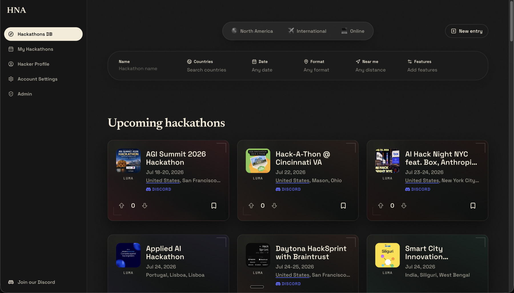

<div align="center">


# Haethon

### The community-powered hackathon discovery and planning platform

Find vetted hackathons, manage every application in one place, build a public
hacker profile, and stay connected with the people you meet along the way.

[](https://github.com/Hackathons-North-America/haethon/actions/workflows/ci-cd.yml)
[](https://nextjs.org/)
[](https://www.typescriptlang.org/)



**[Product](#product-overview) · [Quick start](#quick-start) · [Configuration](#configuration) · [Development](#development) · [Deployment](#deployment)**

</div>

## Product overview

Haethon is the software behind Hackathons North America's event database. It
brings a fragmented hackathon ecosystem into one curated product for hackers,
organizers, and community moderators.

Event listings are collected from public sources and community submissions,
reviewed before publication, and enriched with useful details such as
application dates, location, format, eligibility, travel reimbursement, and
community links. Hackers can then move from discovery to application tracking
without maintaining a separate spreadsheet or calendar.

### For hackers

- **Discover events** across North America, international regions, and online
  formats using keyword, country, date, format, feature, and proximity filters.
- **Manage an application pipeline** with stages for interested, applied,
  accepted, attending, attended, and won.
- **Set timely reminders** for application openings, deadlines, decisions, and
  event start dates; subscribe to country-level event alerts.
- **Build a public profile** with skills, activity, attended events, awards, and
  pinned highlights.
- **Import Devpost history** through a verification flow instead of entering
  every past project and event manually.
- **Follow other hackers** and see which friends are interested, applying, or
  attending an event.
- **Compare the catalog** in Face Off and explore Elo-powered rankings and tier
  lists.
- **Jump to the right place** with calendar links, official websites, source
  attribution, and event-specific Discord channels.

### For organizers

- Submit a new hackathon with only a name and source link, or provide a complete
  event record for faster review.
- Manage published event details through a role-protected organizer console.
- Review attendee information and verify attendance using per-event check-in
  codes.
- Review submissions associated with the organizer's managed events.

### For administrators

- Review community submissions and publish a consistent, moderated catalog.
- Create and edit events, bulk-import structured data, and repair incomplete or
  broken imports.
- Investigate suspicious attendance claims and resolve verification anomalies.
- Manage Discord channel mappings and test production email templates.
- Run scheduled catalog cleanup, email, and Discord synchronization workflows.

## How the platform fits together

```text
Public sources + community submissions
                  │
                  ▼
          Admin review and enrichment
                  │
                  ▼
         Searchable event catalog
          ┌───────┼────────┐
          ▼       ▼        ▼
     Application  Profiles  Face Off
       pipeline   & friends  rankings
          │
          ▼
    Reminders, check-in, and verified history
```

The core web experience only needs the required configuration listed below.
Email, Discord, uploads, analytics, and error reporting are separate
integrations that can be added as needed.

## Technology

| Area | Technology |
| --- | --- |
| Web application | [Next.js 16](https://nextjs.org/) App Router, React 19, TypeScript |
| UI | Tailwind CSS 4, Motion, Lucide |
| Authentication | [Clerk](https://clerk.com/) |
| Data | [Neon](https://neon.tech/) Postgres, PostGIS, `pg_trgm`, Drizzle ORM |
| Email | Resend and React Email |
| File uploads | UploadThing |
| Community automation | Discord REST API |
| Observability | PostHog and Sentry |
| Testing | Vitest, Testing Library, Playwright |
| Delivery | GitHub Actions and Vercel |

## Quick start

### Prerequisites

- [Git](https://git-scm.com/)
- Node.js 24 recommended; Node.js 20.9 or newer is supported by Next.js
- pnpm 11.10.0, as pinned in [`package.json`](package.json)
- A [Neon](https://neon.tech/) Postgres database
- A [Clerk](https://clerk.com/) application
- `unzip` if you plan to seed the GeoNames city dataset

Neon and Clerk free-tier projects are sufficient for local development.

### 1. Clone and install

```bash
git clone git@github.com:Hackathons-North-America/haethon.git
cd haethon
pnpm install --frozen-lockfile
```

If pnpm is not installed, follow the
[pnpm installation guide](https://pnpm.io/installation), then use the version
declared in `package.json`.

### 2. Create the local environment file

```bash
cp .env.example .env.local
```

Add these required values:

```dotenv
DATABASE_URL=postgresql://...
NEXT_PUBLIC_APP_URL=http://localhost:3000

NEXT_PUBLIC_CLERK_PUBLISHABLE_KEY=pk_test_...
CLERK_SECRET_KEY=sk_test_...

CRON_SECRET=replace-with-a-random-local-secret
```

Generate a suitable cron secret with:

```bash
openssl rand -hex 32
```

`CRON_SECRET` protects scheduled endpoints and is also the default signing key
for unsubscribe links. The application validates it at startup, even when no
cron job is being invoked locally.

### 3. Configure Clerk

1. Create a Clerk application and enable the sign-in methods you want.
2. Copy its publishable and secret keys into `.env.local`.
3. Keep the application routes set to `/sign-in` and `/sign-up`.
4. Set the fallback redirects to an existing application route:

   ```dotenv
   CLERK_SIGN_IN_URL=/sign-in
   CLERK_SIGN_UP_URL=/sign-up
   CLERK_SIGN_IN_FALLBACK_REDIRECT_URL=/hackathons
   CLERK_SIGN_UP_FALLBACK_REDIRECT_URL=/hackathons
   ```

5. Add `http://localhost:3000` to Clerk's allowed development origins if your
   Clerk application requires an explicit origin.

Regular users need no metadata. To expose a privileged console, set the Clerk
user's `publicMetadata.role` to `admin` or `organizer`, then start a new session
so the updated claim is available to the application.

### 4. Prepare the database

Run the extension setup and all committed migrations:

```bash
pnpm db:setup
pnpm db:migrate
```

`db:setup` enables PostGIS and `pg_trgm` in the database referenced by
`DATABASE_URL`. If your database provider does not allow extension creation,
run [`scripts/db/setup.sql`](scripts/db/setup.sql) through its SQL console using
an account with the necessary privileges.

Seed the city search dataset:

```bash
pnpm db:seed-cities
```

This command downloads the free GeoNames `cities5000` dataset and upserts it
into Postgres. It is idempotent and can be run again to refresh the data. The
app can start without this step, but city autocomplete and proximity search
will not have useful data.

> [!IMPORTANT]
> Schema changes must use migrations. After editing
> [`lib/db/schema.ts`](lib/db/schema.ts), run `pnpm db:generate`, review the
> generated SQL, and then run `pnpm db:migrate`. Do not use `pnpm db:push`;
> bypassing migration history can create schema drift between environments.

### 5. Start the application

```bash
pnpm dev
```

Open [http://localhost:3000](http://localhost:3000). The public catalog, Face
Off, and shared profiles are accessible without signing in; personal,
organizer, and admin areas require an authenticated account with the
appropriate role.

## Configuration

Variables left blank in `.env.local` are treated as unset. The canonical
template is [`.env.example`](.env.example).

### Required

| Variable | Description |
| --- | --- |
| `DATABASE_URL` | Postgres connection string used by the app, migrations, and seed scripts |
| `NEXT_PUBLIC_APP_URL` | Absolute application origin with no trailing slash |
| `NEXT_PUBLIC_CLERK_PUBLISHABLE_KEY` | Clerk browser-side publishable key |
| `CLERK_SECRET_KEY` | Clerk server-side secret key |
| `CRON_SECRET` | Bearer token for `/api/cron/*` and fallback unsubscribe-signing key |

### Authentication routes

| Variable | Recommended local value |
| --- | --- |
| `CLERK_SIGN_IN_URL` | `/sign-in` |
| `CLERK_SIGN_UP_URL` | `/sign-up` |
| `CLERK_SIGN_IN_FALLBACK_REDIRECT_URL` | `/hackathons` |
| `CLERK_SIGN_UP_FALLBACK_REDIRECT_URL` | `/hackathons` |

### Optional integrations

| Integration | Variables | Enables |
| --- | --- | --- |
| Resend | `RESEND_API_KEY`, `RESEND_AUDIENCE_FROM` | Event reminders, weekly digests, country alerts, and admin email tests |
| Email signing | `EMAIL_UNSUBSCRIBE_SECRET` | Dedicated unsubscribe-token signing key; falls back to `CRON_SECRET` |
| Discord | `DISCORD_BOT_TOKEN`, `DISCORD_CLIENT_ID`, `DISCORD_GUILD_ID` | Event channel creation, links, sorting, and archiving |
| Discord categories | `DISCORD_CANADA_CATEGORY_ID`, `DISCORD_US_CATEGORY_ID`, `DISCORD_DELETED_CATEGORY_ID` | Explicit category mappings; categories can otherwise be resolved by name |
| UploadThing | `UPLOADTHING_TOKEN` | Admin-managed event image uploads |
| PostHog | `NEXT_PUBLIC_POSTHOG_KEY`, `NEXT_PUBLIC_POSTHOG_HOST` | Product analytics |
| Sentry | `NEXT_PUBLIC_SENTRY_DSN`, `SENTRY_AUTH_TOKEN`, `SENTRY_ORG`, `SENTRY_PROJECT` | Runtime error reporting and source-map uploads |

Never commit `.env.local`, service tokens, or production connection strings.
Only variables prefixed with `NEXT_PUBLIC_` are safe to expose to the browser.

## Optional service setup

<details>
<summary><strong>Resend email</strong></summary>

1. Create a Resend API key and add it as `RESEND_API_KEY`.
2. Verify the sending domain with the DNS records supplied by Resend.
3. Set `RESEND_AUDIENCE_FROM` to a sender on that domain, for example
   `Haethon <reminders@example.com>`.
4. Sign in as an admin and use `/admin/email-test` before enabling scheduled
   sends.

The reminder and digest routes return a service-unavailable response when email
is not fully configured; the rest of the application continues to work. See
[the email reminder deployment guide](docs/deploying-email-reminders.md) for a
production checklist.

</details>

<details>
<summary><strong>Discord synchronization</strong></summary>

1. Create an application in the Discord Developer Portal.
2. Create its bot and copy the token to `DISCORD_BOT_TOKEN`.
3. Copy the application ID to `DISCORD_CLIENT_ID`.
4. Install the bot in the target server with **View Channels**, **Manage
   Channels**, **Send Messages**, and **Manage Messages** permissions.
5. Copy the server ID to `DISCORD_GUILD_ID`.
6. Optionally copy category IDs into the category variables. If omitted, the
   sync resolves configured categories by name and creates them when needed.

The integration uses Discord's REST API from the Next.js application; there is
no separate always-on bot process.

When synchronization runs, current event channels are placed in the correct
regional category and ordered by start date. Finished events are moved into
half-year archive categories such as `past-hackathons-h1-2026`. Deleted events
are parked in the configured deleted category for manual cleanup rather than
being destroyed automatically. New channels receive a pinned message linking
to the event website and its Haethon detail page.

</details>

<details>
<summary><strong>PostHog, Sentry, and UploadThing</strong></summary>

- Add the PostHog public project key and host to enable client-side analytics.
- Add the Sentry DSN for reporting. Organization, project, and auth token
  values enable authenticated source-map handling during production builds.
- Add an UploadThing token to enable the image uploader in the admin console.
  Other admin and catalog functionality works without it.

</details>

## Development

### Common commands

| Command | Description |
| --- | --- |
| `pnpm dev` | Start the local Next.js development server |
| `pnpm build` | Create a production build |
| `pnpm start` | Serve the production build |
| `pnpm lint` | Run ESLint across the repository |
| `pnpm typecheck` | Run TypeScript without emitting files |
| `pnpm test` | Run the Vitest suite once |
| `pnpm test:watch` | Run Vitest in watch mode |
| `pnpm test:e2e` | Run Playwright end-to-end tests |
| `pnpm db:setup` | Enable the required Postgres extensions |
| `pnpm db:generate` | Generate a migration from schema changes |
| `pnpm db:migrate` | Apply committed migrations |
| `pnpm db:seed-cities` | Download and upsert the GeoNames city dataset |
| `pnpm db:studio` | Open Drizzle Studio |

Before opening a pull request, run the same core checks used by CI:

```bash
pnpm lint
pnpm typecheck
pnpm test
pnpm build
```

Playwright starts the development server automatically and expects the same
core environment variables as a normal local run.

### Project structure

| Path | Responsibility |
| --- | --- |
| [`app/`](app/) | App Router pages, layouts, route handlers, and scheduled endpoints |
| [`components/`](components/) | Shared product UI and feature-specific interactive components |
| [`lib/`](lib/) | Domain services, validation, auth, integrations, and database access |
| [`lib/db/schema.ts`](lib/db/schema.ts) | Drizzle schema and application data model |
| [`drizzle/`](drizzle/) | Ordered, reviewable SQL migration history |
| [`scripts/`](scripts/) | Database setup, data seeding, backfills, audits, and repairs |
| [`tests/`](tests/) | Unit, integration, and Playwright end-to-end coverage |
| [`docs/`](docs/) | Operational and feature-specific documentation |

## Scheduled jobs

Vercel Cron reads [`vercel.json`](vercel.json) and calls four authenticated
routes:

| Route | Schedule (UTC) | Responsibility |
| --- | --- | --- |
| `/api/cron/send-reminders` | Daily at 12:00 | Send due application and event reminders |
| `/api/cron/send-weekly-digest` | Monday at 12:04 | Send the weekly upcoming-events digest |
| `/api/cron/sync-discord` | Daily at 12:08 | Create, sort, and archive Discord channels |
| `/api/cron/cleanup-hackathons` | Daily at 12:12 | Perform stale-event housekeeping |

Vercel automatically supplies `Authorization: Bearer $CRON_SECRET` to configured
cron requests. Manual requests must include the same header.

## Deployment

The intended production target is Vercel:

1. Create or link a Vercel project.
2. Add all required variables for the Production environment and set
   `NEXT_PUBLIC_APP_URL` to the final HTTPS origin.
3. Add the optional integration variables for the services you intend to use.
4. Apply reviewed database migrations to the production database.
5. Deploy and verify `/api/health`, `/`, `/hackathons`, and the sign-in flow.

GitHub Actions runs dependency auditing, linting, type-checking, unit tests, and
a production build for pull requests to `main`. A successful push to `main`
then creates the Vercel production deployment. Database migrations are
deliberately not applied automatically.

See [CI/CD with GitHub Actions and Vercel](docs/ci-cd.md) for repository secrets,
branch protection, release flow, and rollback guidance.

## Additional documentation

- [CI/CD and production deployment](docs/ci-cd.md)
- [Deploying email reminders](docs/deploying-email-reminders.md)
- [Face Off Elo model](docs/faceoff-elo.md)
